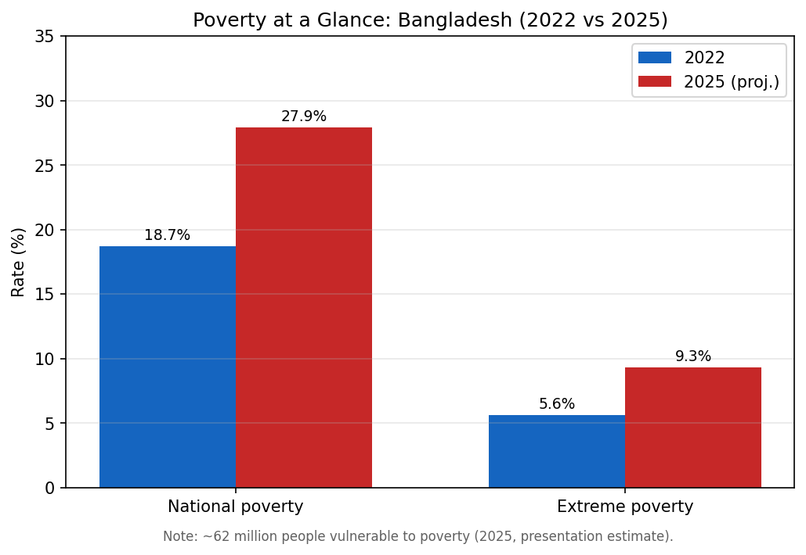
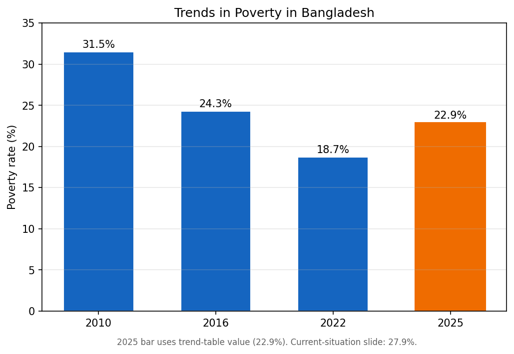
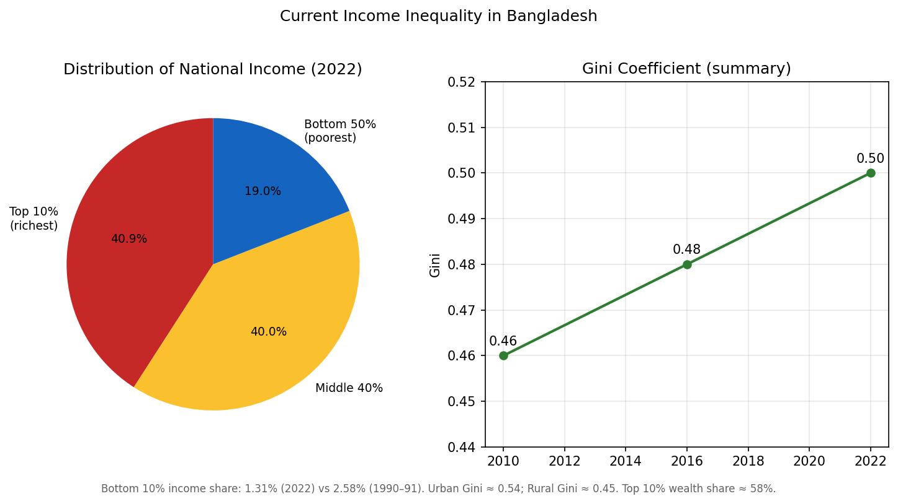
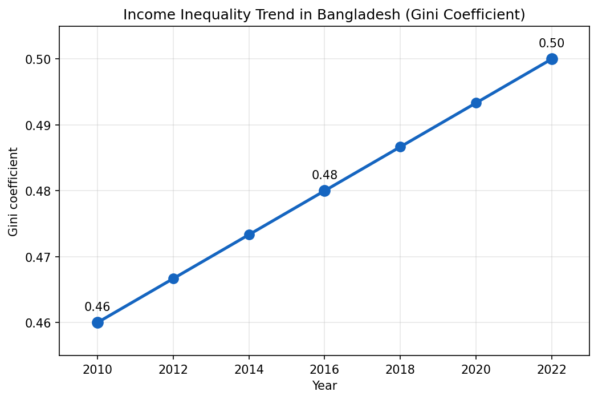
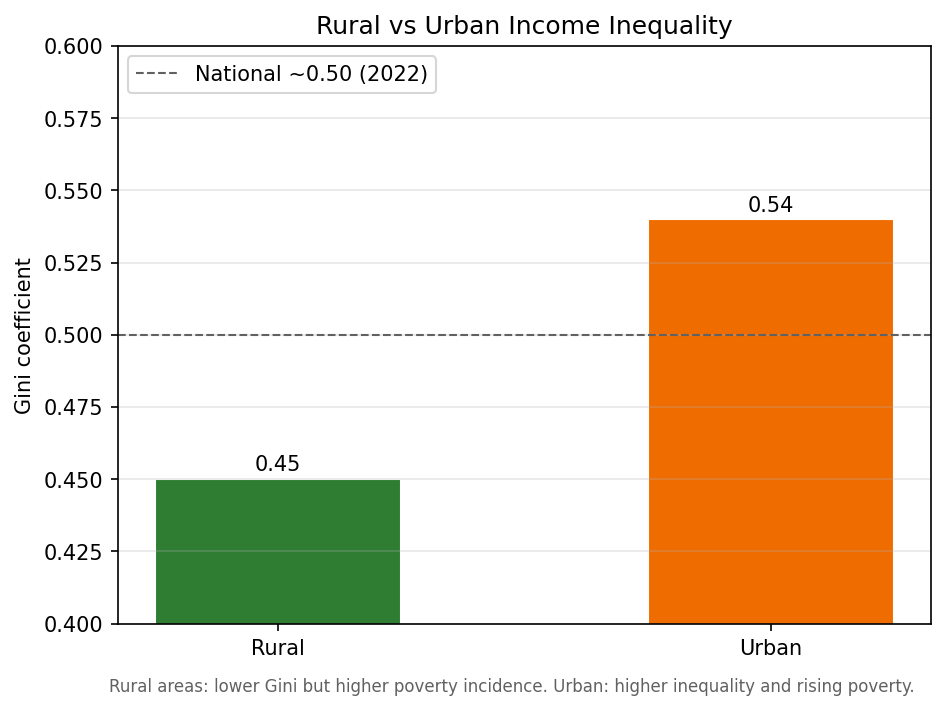
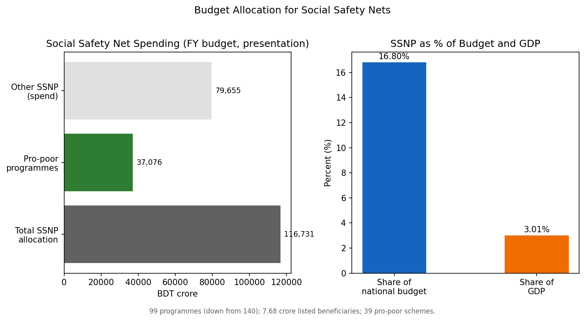
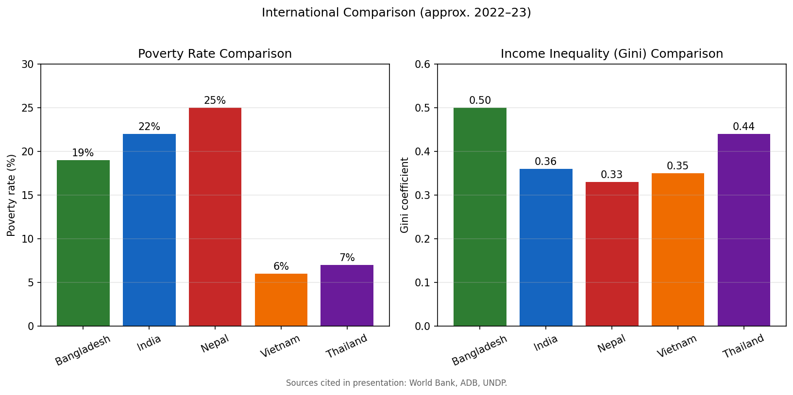

# Poverty, Income Inequality, and Social Safety Net Programs in Bangladesh

**Course:** Econometrics 2  
**Department:** Economics  
**Institution:** Jatiya Kabi Kazi Nazrul Islam University  

**Submitted by:** [Your Name]  
**Student ID:** [Your ID]  
**Section / Group:** [Your Section]  

**Submitted to:** Md. Tanjil Hossain  
Professor, Department of Economics  

**Date:** May 2026  

---

## Abstract

For years Bangladesh was praised because the share of people below the poverty line kept falling. That picture has changed. Recent figures put national poverty near 27.9% in 2025, up from 18.7% in 2022, while extreme poverty is thought to have risen to about 9.3% from 5.6%. The Gini coefficient also moved up, from 0.46 in 2010 to 0.50 in 2022, which means national income growth has not reached households evenly. This paper draws on our Group 10 presentation and related secondary sources to discuss poverty, inequality, social safety nets, and what might improve outcomes. The main point is straightforward: large transfer programmes help, but they cannot substitute for better jobs, fairer targeting, and growth that actually reaches the bottom half of the distribution.

---

## 1. Introduction

Poverty and inequality are not side issues in Bangladesh; they shape how the economy functions. Most households still depend on farming, day labour, small trade, or money sent from relatives abroad. When rice prices jump, when a flood destroys a crop, or when factory orders slow, families that were just above the line can slip back under it within a season.

This assignment uses the slides and charts from our econometrics presentation on *Poverty, Income Inequality and Social Safety Net Program in Bangladesh*, together with published statistics where the slides cite them. The goal is to connect the numbers: rising inequality makes it harder to keep poverty down; poorly targeted safety nets spend a lot but change little for those who need help most.

Below, Section 2 defines poverty, inequality, and safety nets. Sections 3–4 work through the evidence on poverty and the Gini, including Figures 1–5. Section 5 covers programmes and budget figures (Figure 6); Section 6 turns to HDI-related effects and COVID-19; Section 7 compares Bangladesh with India, Nepal, Vietnam, and Thailand (Figure 7). Policy and implementation are discussed in Section 8, and Section 9 ends with recommendations.

### List of Figures

| Figure | Title | Section |
|--------|--------|---------|
| 1 | Poverty at a Glance (2022 vs 2025) | 3.2 |
| 2 | Trends in Poverty, 2010–2025 | 3.3 |
| 3 | Current Income Inequality | 4.2 |
| 4 | Gini Coefficient Trend, 2010–2022 | 4.3 |
| 5 | Rural vs Urban Inequality | 4.4 |
| 6 | SSNP Budget Allocation | 5.2 |
| 7 | International Comparison (Poverty & Gini) | 7 |

---

## 2. Conceptual Framework

### 2.1 Poverty

In practice, a poor household is one that cannot steady afford essentials: rice and other food, a roof that does not leak, drinking water, treatment when someone falls ill, and sending children to school. Researchers often separate *absolute* poverty (fixed against a poverty line) from *relative* poverty (how far someone sits below others in the same society). For international comparison the World Bank uses an extreme poverty line of **$2.15 per day** (2017 purchasing power parity). In Bangladesh, extreme poverty has come down over the long term but remains common in rural areas and among landless workers, female-headed families, and people with disabilities. World Bank work cited in our slides projects that around **15.8 million people** could still live in extreme poverty by the end of 2025.

### 2.2 Income Inequality

Some people earn far more than others; inequality measures that spread. The number most often used is the **Gini coefficient**: 0 would mean everyone earns the same; 1 would mean one person earns everything. When the Gini rises, as it has in Bangladesh, the gap between high and low earners is widening. That matters for more than fairness—high inequality can mean less spending on children’s schooling among the poor and poverty that lasts into the next generation.

### 2.3 Social Safety Net Programs (SSNPs)

Safety nets are government transfers and in-kind help—cash for the elderly, food after disasters, stipends to keep girls and boys in school, and similar schemes. In Bangladesh they take a large share of the budget, but outcomes depend on whether the right people are listed, whether payments arrive on time, and whether families can still find work that pays enough to live on.

---

## 3. Poverty in Bangladesh

### 3.1 Causes

Poverty in Bangladesh arises from a mix of pressures rather than one headline reason. Cyclones, river erosion, and slow recovery after floods hit incomes in chars and coastal districts. Inflation that runs ahead of wages, unemployment, and the fact that skilled formal jobs pay much more than unskilled work all squeeze purchasing power. Dense population, medical bills paid out of pocket, and limited technical training block upward movement. Infrastructure is still thin in many areas, and growth has been Dhaka-heavy while western districts and haor regions lag.

### 3.2 Current Situation (2022 vs 2025)

Our *Poverty at a Glance* infographic shows a sharp worsening after 2022:

| Indicator | 2022 | 2025 (projected / estimated) |
|-----------|------|--------------------------------|
| National poverty rate | 18.7% | ~27.9% |
| Extreme poverty rate | 5.6% | ~9.3% |
| Population vulnerable to poverty | — | ~62 million |

Rural areas have long had more poverty because incomes from crops and seasonal labour are low and unstable. What stands out in the recent material is that **urban poverty is now rising quickly**, tied to insecure informal jobs, rent increases, and migration into cities without stable housing.

The slides point to three immediate pressures: inflation eating into real income, too few good jobs, and shocks at home and abroad.

**Figure 1.** Current poverty situation in Bangladesh (2022 vs 2025)—national and extreme poverty, vulnerability, urban–rural contrast, and main drivers.  
*Source: Group 10 presentation slide; extracted from presentation PDF.*



### 3.3 Trends in Poverty (Graph Analysis)

The *Trends in Poverty* slide gives both a table and a bar chart:

| Year | Poverty rate | Trend description | Key driver |
|------|--------------|-------------------|------------|
| 2010 | 31.5% | High baseline | — |
| 2016 | 24.3% | Significant decline | Agricultural growth and remittances |
| 2022 | 18.7% | Lowest point in the series | Post-COVID recovery phase |
| 2025 | 22.9% (table) / 27.9% (current slide) | Projected / estimated rise | Economic stress; ~3 million new extreme poor (projection narrative) |

**Figure 2.** Trends in poverty in Bangladesh, 2010–2025 (table and bar chart).  
*Source: Group 10 presentation slide.*



Read against the bars, the story is clear: poverty fell from 2010 through 2022 as remittances, exports, and farm output often did well. The 2025 bar climbs again, breaking that downward line. In econometrics terms one could describe this as a break in the earlier trend—the factors that pulled poverty down before 2022 (including steadier food prices and strong overseas employment) weigh less once inflation and weak job growth dominate.

The presentation uses two different figures for 2025 poverty (22.9% in the trend table and 27.9% on the current situation slide). That usually means different surveys or forecasts. In a formal paper one would pick one source—HIES, World Bank, or government projection—and stick to it; here both are noted because they appeared in the material we were given.

---

## 4. Income Inequality in Bangladesh

### 4.1 Causes

The slides grouped causes into five areas: unequal access to good schools; higher pay for formal skills than for farm or casual work; uneven investment across regions; concentration of land and other assets; and an economic structure that rewards capital-intensive services in cities more than labour-intensive activity in villages.

### 4.2 Current Distribution

The *Current Income Inequality* slide reports:

- **Gini coefficient:** 0.46 (2010) → 0.50 (2022)  
- **Income shares (2022):** top 10% ≈ 40.9% of national income; bottom 50% ≈ 19.05%  
- **Bottom decile:** income share fell from 2.58% (1990–91) to 1.31% (2022)  
- **Urban Gini ≈ 0.54** vs **rural Gini ≈ 0.45**  
- **Wealth concentration:** top 10% own ~58% of total wealth; top 1% ~24%

The pie chart and seesaw picture make the same point in visual form: the richest tenth receive roughly twice the income share of the entire bottom half. Wealth is even more concentrated than yearly income, which is what we often see when land and house prices rise faster than wages.

**Figure 3.** Current income inequality in Bangladesh—Gini change (2010–2022), national income shares, bottom decile decline, urban/rural Gini, and wealth concentration.  
*Source: Group 10 presentation slide.*



### 4.3 Inequality Trends (Line Graph Analysis)

**Figure 4.** Income inequality trend in Bangladesh (Gini coefficient), 2010–2022.  
*Source: Group 10 presentation slide.*



The line graph plots the Gini at 0.46 (2010), about 0.48 (2016), and 0.50 (2022). The line slopes upward fairly steadily, not in a single jump. That fits the idea that growth has been real but not pro-poor enough—agriculture and tiny enterprises that employ many poor people have not gained at the same pace as finance, property, and parts of large industry.

### 4.4 Rural vs Urban Inequality

Measured inequality is **lower in rural areas** (Gini ≈ 0.45) but **poverty is more common** because average income is low. **Cities show higher inequality** (Gini ≈ 0.54): a thin layer of well-paid professionals and a large mass in informal work and slums. Dhaka and other urban centres illustrate how fast migration without cheap housing and transport can raise both inequality and the risk of urban poverty.

**Figure 5.** Rural vs urban inequality—Gini comparison, poverty incidence, and main economic differences.  
*Source: Group 10 presentation slide.*



---

## 5. Social Safety Net Programs in Bangladesh

### 5.1 Major Programs

Bangladesh runs many schemes; our presentation highlighted five: **Vulnerable Group Feeding (VGF)** for food in crises; **Old Age Allowance**; allowances for **widows and deserted women** and for **persons with disabilities**; and **primary education stipends** to keep poor children in school. These measures ease hardship, especially in bad years, but few families escape poverty permanently without earning more from work.

### 5.2 Budget Allocation

According to the slides:

- Total SSNP allocation: **BDT 1,16,731 crore** (~USD 9.57 billion)  
- Share of national budget: **16.8%**; share of GDP: **~3.01%**  
- Number of programs: **99** (down from 140)  
- Pro-poor programs: **39**, with **BDT 37,076 crore** for **7.68 crore** vulnerable people  
- Allowance increases of **BDT 50–100** for elderly, widows, and disabled beneficiaries  

By regional standards that is a large commitment. Still, when rice and fuel cost more each year, the monthly amounts many families receive stay small in real terms.

**Figure 6.** Social safety net budget allocation—total outlay, share of budget/GDP, programme consolidation, and pro-poor focus.  
*Source: Group 10 presentation slide.*



### 5.3 Effectiveness

Where targeting works, villages report less extreme poverty, better food security after floods, higher enrolment, and some protection for rural livelihoods. Where it does not, the same problems return: names on the list that should not be there, payments arriving late, money lost to corruption, and allowances that buy less each year because prices move faster than the transfer. Help at the bottom does not stop concentration at the top; both can be true at once.

---

## 6. Impacts on Economy, Society, and Human Development

### 6.1 Economic and Social Effects

Wide poverty alongside a wealthy minority changes how the economy behaves day to day. Poor households buy less, so demand for local goods stays weak; firms then have less reason to invest in labour-saving upgrades, and assets stay in few hands. At home, families may switch from fish or meat to cheaper staples; women pick up extra unpaid care when clinics or schools are far away; union offices face long queues for allowances they cannot always pay on schedule.

### 6.2 Human Development Index (HDI)

HDI combines education, health, and living conditions, not just cash income. Poor children often study in overcrowded rooms and leave school early to work; few have tutors or reliable internet for homework. Clinic fees and malnutrition still weigh heavily on mothers and infants. Housing without safe drainage, or power that fails in summer, lowers everyday wellbeing even when income is above the poverty line. For these reasons inequality drags on Bangladesh’s HDI score over time, not only the Gini.

### 6.3 COVID-19 Legacy

During COVID-19 rickshaw pullers, garment helpers, and market vendors lost days of pay; many students in villages had no online class; families spent savings on treatment. National output has recovered on paper, yet a large share of households entered 2023 with thinner buffers, more teenagers out of school, and worse informal jobs—just as food and rent inflation accelerated again.

---

## 7. International Comparison

Our *International Comparison* slide set Bangladesh beside India, Nepal, Vietnam, and Thailand (World Bank / ADB / UNDP, roughly 2022–23):

| Country | Poverty rate (approx.) | Gini coefficient (approx.) | Brief insight |
|---------|------------------------|----------------------------|---------------|
| Bangladesh | 18–20% | 0.49–0.50 | Poverty fell historically, but inequality is high and rising |
| India | 21–23% | 0.35–0.37 | Larger absolute poor population; moderate inequality |
| Nepal | 24–26% | 0.32–0.34 | Higher poverty, lower inequality than Bangladesh |
| Vietnam | 5–7% | 0.35–0.36 | Low poverty with relatively equal growth pattern |
| Thailand | 6–8% | 0.43–0.45 | Low poverty but relatively high inequality |

**Figure 7.** International comparison of poverty rates and Gini coefficients—Bangladesh, India, Nepal, Vietnam, and Thailand (table and bar charts).  
*Source: Group 10 presentation slide; underlying data cited as World Bank, ADB, UNDP (2022–23).*



In the bar charts, Bangladesh’s poverty rate sits below Nepal’s and somewhat below India’s, but well above Vietnam and Thailand. On the Gini, Bangladesh’s bar (~0.50) is the highest in the group—above Thailand and clearly above India and Nepal.

Bangladesh has done better than some neighbours at cutting poverty over time, but worse at keeping distribution fair. Vietnam shows that strong farm output, export factories, and spending on basic services can hold poverty low without letting inequality run toward 0.50.

---

## 8. Government Policies and Challenges

### 8.1 Policy Directions

Bangladesh does not rely on one programme to fight poverty; policy is stitched together from plans, transfers, and sector budgets. Five-Year Plans repeat the goal of balanced growth, yet factories and formal jobs still cluster around Dhaka and Chattogram, while Rangpur, the chars, and much of the coast see slower change. Recent budgets talk of folding roughly 140 safety-net schemes into ninety-nine and of slightly higher cash for the elderly, widows, and disabled people. Alongside that, government spending on roads, public works, and small enterprises reflects an obvious fact: most poor families live on wages, not allowances. Education, health, and technical training are supposed to open better jobs; food and fuel subsidies are meant to soften price rises. The difficulty is not the absence of policy on paper but uneven execution—who gets listed at union level still depends too often on local influence.

### 8.2 Key Challenges

Delivery is where policy often fails. Allowance lists are not always checked; better-off households sometimes collect benefits while poorer neighbours are left off the roll, a form of elite capture noted in much of the literature. School stipends help attendance more than learning or hiring, especially after primary level. Cities pull in workers faster than they offer decent housing, so slum poverty and high rent have grown serious; national poverty is projected near 27.9% in 2025. Social protection takes about 16.8% of the budget and lists 7.68 crore people, yet roughly 62 million are described as at risk of falling into poverty—suggesting small real transfers once inflation is counted. Late payments and little public reporting weaken trust. Floods in haor and coastal areas and rising food costs can wipe out gains from GDP growth that look strong in the aggregate.

---

## 9. Recommendations and Conclusion

### 9.1 Recommendations

The following points draw together what the data and slides imply for policy.

**Targeting.** A single updated household register, linked to national ID where possible, with union-level checking by community members, could reduce wrong inclusions and exclusions. Political pressure on lists should be handled as a governance problem, not only a technical one.

**Benefit levels.** Allowances for the elderly and other groups need periodic adjustment against food and essential goods; otherwise increases of Tk 50–100 disappear within a year of inflation.

**Transparency.** Simple quarterly statements—money released, names paid, dates—posted online or on union notice boards would not stop corruption alone but would make delays harder to ignore.

**Monitoring.** BBS, universities, or outside researchers could revisit sample villages after programme changes and report whether enrolment, food security, or poverty indicators moved. Tying part of funding to verified results may work better than launching more schemes with the same delivery channels.

**Jobs and skills.** Technical training linked to garments, logistics, light engineering, and climate-resilient farming, with stipends tied to completion, would address the root problem that transfers alone cannot solve.

**Rural economy.** Irrigation, extension services, and rural roads still matter because so many poor households depend on farm and non-farm village work.

**Growth pattern.** Policy should favour sectors that hire many workers at liveable wages, not only projects that raise average GDP while the Gini stays near 0.50.

### 9.2 Conclusion

Bangladesh’s record since 2010 is mixed. Poverty in our bar chart fell from 31.5% to 18.7% by 2022—genuine progress, helped by remittances, garment exports, and good harvests in many years. The same chart turns up again for 2025; the current-poverty slide puts the rate near 27.9%, with extreme poverty almost double the 2022 level. The Gini line reaches 0.50, and the bottom tenth’s income share is only about 1.31%, far below the 2.58% seen in 1990–91.

Safety nets still matter: rice after floods, cash for the old, stipends that keep some children in class. The budget allocation we cited—over BDT one lakh crore—shows real fiscal effort. Yet when jobs are scarce, prices high, and delivery uneven, transfers cannot by themselves fix inequality or long-term poverty.

What is required is both: fairer administration of protection programmes and growth that reaches informal workers and rural families, not only headline GDP. Without that balance, the next HIES round will likely repeat what our graphs already suggest—averages that look better than life at the bottom of the distribution.

---

## References

Bangladesh Bureau of Statistics. (Various years). *Household Income and Expenditure Survey (HIES).*  

Government of the People’s Republic of Bangladesh. (2024–25). *National Budget Documents* (Social Safety Net allocations).  

Asian Development Bank. (2023). *Asian Development Outlook.*  

United Nations Development Programme. (2023). *Human Development Report.*  

World Bank. (2023–25). *Bangladesh poverty and equity brief* and *Poverty and Inequality Platform* (including $2.15/day line note).  

World Bank. (2025). Extreme poverty projection for Bangladesh.  

Group 10 (2026). *Poverty, income inequality and social safety net program in Bangladesh* [PowerPoint presentation]. Department of Economics, Jatiya Kabi Kazi Nazrul Islam University.

---

## Appendix: Generating Figures (Python)

Figures 1–7 in this document are produced by the script `generate_assignment_graphs.py` (same data as the Group 10 presentation). Original slide screenshots remain in `pdf_images/` for reference.

**Setup and run** (from `/Users/eloneflax/personal/`):

```bash
pip3 install -r requirements-graphs.txt
python3 generate_assignment_graphs.py
```

Charts are written to `generated_graphs/`:

| File | Figure |
|------|--------|
| `figure1_poverty_glance.png` | 1 |
| `figure2_poverty_trends.png` | 2 |
| `figure3_income_inequality.png` | 3 |
| `figure4_gini_trend.png` | 4 |
| `figure5_rural_urban.png` | 5 |
| `figure6_budget_allocation.png` | 6 |
| `figure7_international_comparison.png` | 7 |

Edit the data lists at the top of each function in the script to change values, then re-run. Keep `generated_graphs/` beside this `.md` file when exporting to Word or PDF.

**Optional slides** (not auto-generated): `pdf_images/page_17.png` (SSNP effectiveness), `page_21.png` (COVID-19), `page_22.png` (government policies).
