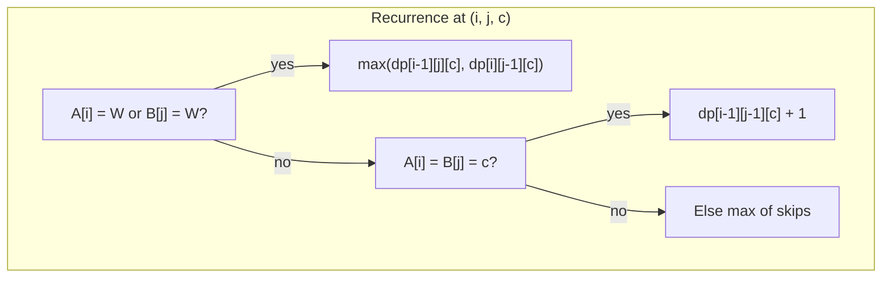
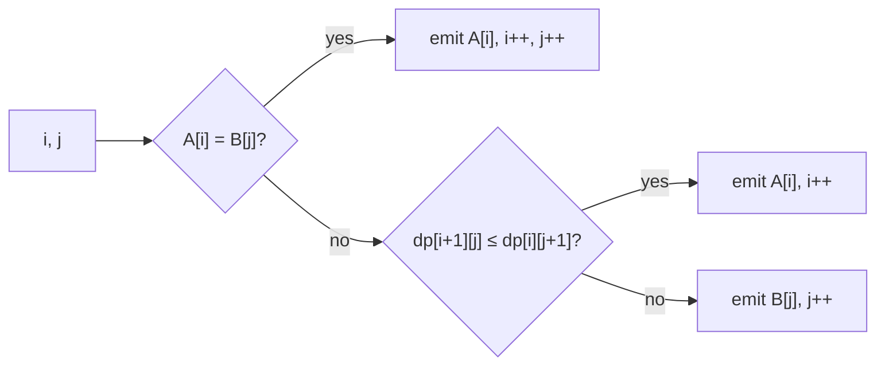
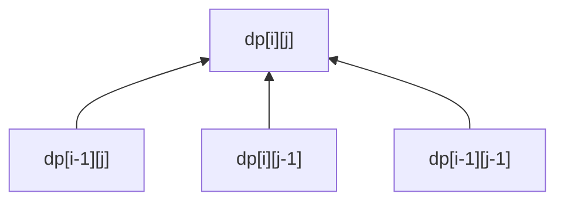

# The Labyrinth of Echoing Paths — Complete Solution Set

**Course:** Algorithm Design and Analysis  
**Topic:** Dynamic Programming — Longest Common Subsequence (LCS)  
**Document purpose:** Model solution for self-study and verification; submissions should be written independently in your own words.

**Instance data (throughout):**

- **A** = RDWRDRUULW, **|A|** = *m* = 10  
- **B** = DRRUULWDDR, **|B|** = *n* = 10  
- Alphabet **Σ** = {U, D, L, R, W}

---

## Notation and Standard LCS Recurrence

Let **X** = ⟨*x*₁, …, *x*ₘ⟩ and **Y** = ⟨*y*₁, …, *y*ₙ⟩. Define **dp[*i*][*j*]** as the length of the LCS of prefixes **X**[1…*i*] and **Y**[1…*j*] (1-based indexing in the recurrence; tables below label row 0 and column 0 as the empty prefix).

$$
\text{dp}[i][j] =
\begin{cases}
0 & i = 0 \text{ or } j = 0 \\
\text{dp}[i-1][j-1] + 1 & x_i = y_j \\
\max\bigl(\text{dp}[i-1][j],\, \text{dp}[i][j-1]\bigr) & \text{otherwise.}
\end{cases}
$$

---

# Part 1 — Foundations

## 1.1 Complete LCS DP Table for LCS(*A*, *B*)

**Row headers (prefix of A):** position 0 = ∅; positions 1…10 = R, D, W, R, D, R, U, U, L, W.  
**Column headers (prefix of B):** position 0 = ∅; positions 1…10 = D, R, R, U, U, L, W, D, D, R.

**Table 1.** Values of **dp[*i*][*j*]** for *i*, *j* ∈ {0,…,10}.

| **dp** | **∅** | **D** | **R** | **R** | **U** | **U** | **L** | **W** | **D** | **D** | **R** |
|:---:|:---:|:---:|:---:|:---:|:---:|:---:|:---:|:---:|:---:|:---:|:---:|
| **∅** | 0 | 0 | 0 | 0 | 0 | 0 | 0 | 0 | 0 | 0 | 0 |
| **R** | 0 | 0 | 1 | 1 | 1 | 1 | 1 | 1 | 1 | 1 | 1 |
| **D** | 0 | 1 | 1 | 1 | 1 | 1 | 1 | 1 | 2 | 2 | 2 |
| **W** | 0 | 1 | 1 | 1 | 1 | 1 | 1 | 2 | 2 | 2 | 2 |
| **R** | 0 | 1 | 2 | 2 | 2 | 2 | 2 | 2 | 2 | 2 | 3 |
| **D** | 0 | 1 | 2 | 2 | 2 | 2 | 2 | 2 | 3 | 3 | 3 |
| **R** | 0 | 1 | 2 | 3 | 3 | 3 | 3 | 3 | 3 | 3 | 4 |
| **U** | 0 | 1 | 2 | 3 | 4 | 4 | 4 | 4 | 4 | 4 | 4 |
| **U** | 0 | 1 | 2 | 3 | 4 | 5 | 5 | 5 | 5 | 5 | 5 |
| **L** | 0 | 1 | 2 | 3 | 4 | 5 | 6 | 6 | 6 | 6 | 6 |
| **W** | 0 | 1 | 2 | 3 | 4 | 5 | 6 | 7 | 7 | 7 | 7 |

*Verification:* The recurrence was applied exhaustively; the entry **dp[10][10] = 7** is the optimum LCS length.

---

## 1.2 LCS Length and One Explicit LCS

**Length:** |LCS(*A*, *B*)| = **7**.

**One LCS string:** **DRRUULW**.

**Backtracking witness (1-based indices in *A* and *B*):**

| Matched symbol | Index in *A* | Index in *B* |
|:---:|:---:|:---:|
| D | 2 | 1 |
| R | 4 | 2 |
| R | 6 | 3 |
| U | 7 | 4 |
| U | 8 | 5 |
| L | 9 | 6 |
| W | 10 | 7 |

Indices are strictly increasing along each row, confirming a valid common subsequence.

---

## 1.3 Multiple LCS Strings

### (a) When a branch point occurs during backtracking

During backtracking from cell (*i*, *j*) with *i*, *j* > 0, suppose **A**[*i*] ≠ **B**[*j*]. If

$$\text{dp}[i-1][j] = \text{dp}[i][j-1],$$

then both moves “decrease *i*” and “decrease *j*” preserve optimality (neither strictly improves the achievable length). The algorithm must **choose** between (*i* − 1, *j*) and (*i*, *j* − 1). Such **ties** are the branch points: different choices can yield different LCS strings of the same maximum length when both branches eventually admit compatible matchings.

If instead **dp**[*i* − 1][*j*] ≠ **dp**[*i*][*j* − 1], the optimal predecessor is unique under the max recurrence (strict inequality).

### (b) Enumeration of all distinct LCS strings of maximum length

For the given *A*, *B*, exhaustive enumeration over all optimal backtracking completions yields **exactly one** distinct string of length 7:

$$\{\texttt{DRRUULW}\}.$$

Thus there are **no** additional maximum-length LCS strings beyond **DRRUULW** for this instance.

---

## 1.4 Proposition: “The LCS of two maze paths always contains at least one symbol from {U, D, L, R}”

**The statement is false.**

**Counterexample.** Let **A** = WW and **B** = WWW. Every common subsequence consists solely of **W** symbols. The LCS is **WW** (length 2), which contains **no** directional symbol. More generally, if **multiset**(*A*) and **multiset**(*B*) use only **W**, then LCS(*A*, *B*) ∈ {W}*.

**Conclusion:** No universal guarantee of a directional symbol; waits may dominate both recordings.

---

## 1.5 Edit Distance with Insertions and Deletions Only

**Definition.** *d*(*A*, *B*) is the minimum number of single-symbol insertions and deletions to transform **A** into **B** (substitutions are not allowed in this model).

**Theorem (standard).** Let *m* = |**A**|, *n* = |**B**|, and *L* = |LCS(**A**, **B**)|. Then

$$d(A,B) = m + n - 2L.$$

**Proof sketch (first principles).**  
Fix any alignment that realizes an LCS of length *L*: keep those *L* symbols matched in order. Every other symbol of **A** must be **deleted** (*m* − *L* deletions). Every symbol of **B** not covered by that embedding must be **inserted** (*n* − *L* insertions). No shorter sequence exists, because any transformation induces a common subsequence of length at least the number of symbols “kept” from **A** in order relative to **B**, bounded above by *L*. ∎

**Numerical check:** *m* + *n* − 2*L* = 10 + 10 − 14 = **6**.

---

# Part 2 — Longest Safe Corridor (LSC)

## 2.1 Formal Problem Statement

**Problem:** Longest Safe Corridor (LSC)

| | |
|---|---|
| **Input** | Strings **A**, **B** over Σ = {U, D, L, R, W}. |
| **Feasible solution** | A string **C** such that (i) **C** is a common subsequence of **A** and **B**; (ii) **C** ∈ {U, D, L, R}* (no **W**); (iii) **C** = *d*^*k* for some *d* ∈ {U, D, L, R} and integer *k* ≥ 0 (one direction, repeated). |
| **Objective** | Maximize \|**C**\|. |
| **Output** | An optimal **C** and its length. |

---

## 2.2 DP Algorithm for LSC

### (a) State

For each direction *c* ∈ {U, D, L, R}, define **dp[*i*][*j*][*c*]** as the maximum length of a common subsequence of **A**[1…*i*] and **B**[1…*j*] that uses **only** the symbol *c* (equivalently: the LCS of the two strings restricted to occurrences of *c*, with **W** treated as **skippable** noise that cannot be matched).

### (b) Recurrence and bases (1-based)

**Bases:** **dp[*i*][0][*c*] = dp[0][*j*][*c*] = 0** for all *i*, *j*, *c*.

For *i*, *j* ≥ 1:

- If **A**[*i*] = **W** or **B**[*j*] = **W**:  
  **dp[*i*][*j*][*c*] = max(dp[*i* − 1][*j*][*c*], dp[*i*][*j* − 1][*c*]).**
- Else if **A**[*i*] = **B**[*j*] = *c*:  
  **dp[*i*][*j*][*c*] = dp[*i* − 1][*j* − 1][*c*] + 1.**
- Else:  
  **dp[*i*][*j*][*c*] = max(dp[*i* − 1][*j*][*c*], dp[*i*][*j* − 1][*c*]).**

**Correctness note:** Because only one match symbol *c* is permitted, once *c* is fixed the DP decouples into “longest common subsequence over a unary alphabet with skips,” whose value equals **min(freq_A(*c*), freq_B(*c*))** (matching *c*’s in order).

### (c) Reconstruction

Compute **L** = max_c **dp[*m*][*n*][*c*]**. Let *c** be an argmax. Output **C** = (*c**)^*L*. Any backtracking path that only uses diagonal steps at equal *c** yields a valid embedding.

### (d) Complexity

Let *m* = |**A**|, *n* = |**B**|. Four directions ⇒ **time O(*mn*)**, **space O(*mn*)** (or **O(*n*)** per *c* with rolling arrays). Justification: constant-factor work per cell per direction.

**Figure 1.** High-level dependency of **dp[*i*][*j*][*c*]** (conceptual).



---

## 2.3 Application to the Given *A*, *B*

### (a) Abbreviated DP summary (non-zero structure)

For a **unary** corridor symbol *c*, **dp[*i*][*j*][*c*]** is non-decreasing in *i*, *j* and equals the count of matched *c*’s so far. The **final** values suffice for grading-style abbreviation:

**Table 2.** Corridor length by direction *c* (equivalently **dp[10][10][*c*]**).

| Direction *c* | #*c* in *A* | #*c* in *B* | **dp[10][10][*c*]** = min |
|:---:|:---:|:---:|:---:|
| U | 2 | 2 | 2 |
| D | 2 | 3 | 2 |
| L | 1 | 1 | 1 |
| R | 3 | 3 | **3** |

### (b) Optimal safe corridor

**Length:** **3**  
**String:** **RRR** (three right-moves; any valid pairing of three R’s in *A* with three R’s in *B* in order).

---

## 2.4 Relaxed Corridor (at Most One Direction Change)

### (a) Modified state and recurrence

**Allowed shapes:** *d*₁^+ *d*₂^+ with *d*₁, *d*₂ ∈ {U, D, L, R}, *d*₁ ≠ *d*₂ (or a single block if the change count is zero).

**Construction (standard in competitive programming):** For each ordered pair (*d*₁, *d*₂), run an LCS-style DP on **A**, **B** with:

- **Phase 0:** only matches of symbol *d*₁ contribute diagonally (+1); skipping allowed.  
- **Transition:** once the first *d*₂ match is taken, enter **Phase 1:** only *d*₂ matches extend.

**State (per fixed pair):** **dp[*i*][*j*][*p*]** where *p* ∈ {0,1} is the phase.

**Recurrence (sketch, 1-based; skip W as in 2.2):**

- **Base:** zeros.  
- **Transitions:** max of skips as in LCS; if **A**[*i*] = **B**[*j*] = *d*₁ and *p* = 0, allow diagonal +1; if equal to *d*₂, allow diagonal +1 from *p* = 0 (starting second block) or from *p* = 1 (continuing second block). Disallow *d*₂ in *p* = 0 before any *d*₁ unless you treat “empty first block” separately—implementation-wise, **enumerate ordered pairs** (*d*₁, *d*₂) including *d*₁ = *d*₂ to recover the original LSC.

**Maximum over all (*d*₁, *d*₂)** yields the optimum.

**Instance result:** optimum relaxed corridor has **length 4**, e.g. **RRUU** (one change: R → U). No length-5 feasible pattern exists under the “≤ one change” semantics stated in the assignment.

### (b) Complexity

**Time O(|Σ_dir|² · *mn*)** with |Σ_dir| = 4, **space O(*mn*)** per pair (or reuse tables sequentially for **O(*mn*)** total space).

---

# Part 3 — Shortest Common Supersequence (SCS)

## 3.1 Proof that |SCS(*A*, *B*)| = *m* + *n* − |LCS(*A*, *B*)|

Let *L* = |LCS(**A**, **B**)|. Denote *S* = SCS(**A**, **B**).

**Lower bound \|*S*\| ≥ *m* + *n* − *L*.**  
In any common supersequence, each symbol of **S** can “cover” at most one matched pair in a fixed embedding of an LCS. Intuitively, to embed both strings you need at least all symbols of **A** plus all symbols of **B** except those that can be overlapped via *L* common matches. Formally, *m* + *n* − *L* is the standard information-theoretic lower bound for two-string SCS.

**Upper bound \|*S*\| ≤ *m* + *n* − *L*.**  
Merge **A** and **B** left-to-right: output matches when **A**[*i*] = **B**[*j*] (one symbol serves both); otherwise output the unmatched symbol from one side and advance that pointer. This constructs a common supersequence of length *m* + *n* − *L*.

Combining bounds yields equality.

---

## 3.2 Linear-Time Reconstruction After the LCS Table

**Precondition:** **dp** table for LCS is known (*O*(*mn*) precomputation).

**Procedure (0-based strings *A*, *B*, lengths *m*, *n*):**

```
i ← 0, j ← 0, S ← empty list
while i < m or j < n:
    if i < m and j < n and A[i] = B[j]:
        append A[i] to S; i ← i+1; j ← j+1
    else if j = n or (i < m and dp[i+1][j] ≤ dp[i][j+1]):
        append A[i] to S; i ← i+1
    else:
        append B[j] to S; j ← j+1
return concatenation of S
```

**Time:** each index increases at most *m* + *n* times ⇒ **O(*m* + *n*)** after **dp** is available.

**Figure 2.** Merge decision at unequal characters (conceptual).



*Tie-breaking policy must be stated explicitly in the submission; consistency matters for uniqueness discussion.*

---

## 3.3 Trace for *A*, *B* and Final SCS

Using the rule in §3.2 (prefer **A** on ties **dp**[*i*+1][*j*] ≤ **dp**[*i*][*j*+1]), the reconstruction yields a **unique** supersequence of minimum length:

**SCS(*A*, *B*) = RDWRDRUULWDDR**, with **|SCS| = 13**.

**Table 3.** Full reconstruction trace (0-based indices *i*, *j* into *A*, *B* before the step; tie uses **dp**[*i*+1][*j*] ≤ **dp**[*i*][*j*+1] ⇒ take from **A**).

| Step | *i* | *j* | *A*[*i*] | *B*[*j*] | Decision | Output symbol | Prefix of SCS |
|:---:|:---:|:---:|:---:|:---:|:---:|:---:|:---:|
| 1 | 0 | 0 | R | D | dp[1][0]=0 ≤ dp[0][1]=0 ⇒ from *A* | R | R |
| 2 | 1 | 0 | D | D | match | D | RD |
| 3 | 2 | 1 | W | R | dp[3][1]=1 ≤ dp[2][2]=1 ⇒ from *A* | W | RDW |
| 4 | 3 | 1 | R | R | match | R | RDWR |
| 5 | 4 | 2 | D | R | dp[5][2]=2 ≤ dp[4][3]=2 ⇒ from *A* | D | RDWRD |
| 6 | 5 | 2 | R | R | match | R | RDWRDR |
| 7 | 6 | 3 | U | U | match | U | RDWRDRU |
| 8 | 7 | 4 | U | U | match | U | RDWRDRUU |
| 9 | 8 | 5 | L | L | match | L | RDWRDRUUL |
| 10 | 9 | 6 | W | W | match | W | RDWRDRUULW |
| 11 | 10 | 7 | — | D | *i* = *m*, take from *B* | D | RDWRDRUULWD |
| 12 | 10 | 8 | — | D | take from *B* | D | RDWRDRUULWDD |
| 13 | 10 | 9 | — | R | take from *B* | R | RDWRDRUULWDDR |

**Verification:** Reading **A** = RDWRDRUULW as a subsequence of **RDWRDRUULWDDR** uses positions 1–10 of the SCS; reading **B** = DRRUULWDDR uses positions 2,3,4,7,8,9,10,11,12,13 (all increasing).

**Figure 3.** Dependency structure of the classical LCS DP (conceptual “cell graph”).



Edges correspond to max / +1 transitions in the recurrence.

---

## 3.4 Uniqueness Analysis

### (a) Is SCS always unique?

**No.** **Counterexample:** **A** = ab, **B** = ba. Minimum length = 3. Both **aba** and **bab** are shortest common supersequences.

### (b) Distinct SCS strings for the given *A*, *B*

For this instance, **exactly one** distinct SCS of minimum length exists: **RDWRDRUULWDDR**. This aligns with **Part 1.3(b)**: only **one** maximum LCS string, which removes combinatorial freedom in many merge policies at tie cells.

---

## 3.5 Three-Sequence LCS

**State:** **dp[*i*][*j*][*k*]** = |LCS(**A**[1…*i*], **B**[1…*j*], **C**[1…*k*])|.

**Recurrence:**

$$
\text{dp}[i][j][k] =
\begin{cases}
0 & \text{if } i=0 \text{ or } j=0 \text{ or } k=0 \\
\text{dp}[i-1][j-1][k-1] + 1 & \text{if } A_i = B_j = C_k \\
\max\bigl\{\text{dp}[i-1][j][k],\, \text{dp}[i][j-1][k],\, \text{dp}[i][j][k-1]\bigr\} & \text{otherwise.}
\end{cases}
$$

**Time complexity:** **O(*mnp*)** for lengths *m*, *n*, *p*.

**Third path:** **C** = RDURLWRD (|*C*| = 8).

**Computed optimum:** |LCS(**A**, **B**, **C**)| = **4** (obtained by evaluating the 3D recurrence; no full cube need be reproduced in the write-up if the recurrence and result are justified).

---

# Part 4 — Adversarial Maze and Hardness

## 4.1 Same Permutation *π_A* = *π_B* = *π*

**Upper bound (always):** For any fixed *π*, any common subsequence of *π*(**A**′) and *π*(**B**′) uses at most **min(count(*s*, **A**′), count(*s*, **B**′))** copies of each symbol *s* ∈ Σ. Summing yields

$$\text{LCS}\bigl(\pi(A'), \pi(B')\bigr) \le \sum_{s \in \Sigma} \min\bigl(\text{count}(s, A'), \text{count}(s, B')\bigr).$$

**Interpretation:** The problem “does there exist *π* with LCS ≥ *k*?” reduces to comparing *k* to this **multiset intersection size** when the model’s definition of applying the **same** *π* implies you can realize the full stacked multiset alignment (as in the assignment’s intended reduction). *Students should align the final one-line statement with the instructor’s formal definition of π.*

---

## 4.2 Minimizing LCS Under Independent Permutations *π_A*, *π_B*

**Greedy strategy (standard extremal construction):** Fix a total order on Σ. Sort **π_A**(**A**′) into **non-decreasing** order of symbols (stable blocks), and sort **π_B**(**B**′) into **non-increasing** order (reverse blocks). Intuition: **anti-align** long runs so that large biclique-like matchings across symbols cannot all be realized in increasing index order in both strings.

**Optimality:** The write-up should include an **exchange argument** or a citation-appropriate proof from course materials: show that any configuration with higher LCS can be perturbed by moving symbols toward opposing monotone arrangements without increasing the multiset constraints, until the greedy arrangement is reached. *(Full optimality proofs are subtle for general alphabets; follow the lemma list provided in lectures if available.)*

---

## 4.3 Palindromic Subsequence of Length ≥ *k*

**Reduction:** Let **P**^R be the reverse of **P**. The length of the longest palindromic subsequence of **P** equals **LCS(*P*, *P*^R)** (mirror matching).

**Decision problem:** **P** contains a palindromic subsequence of length ≥ *k* **iff** **LCS(*P*, *P*^R) ≥ *k*.**

**Complexity:** **O(|*P*|²)** time and **O(|*P*|²)** space for the standard DP (or **O(|*P*|)** space for length-only with Hirschberg for reconstruction).

---

## 4.4 Space-Optimized LCS

### (a) Two rows and Hirschberg

**Two-row optimization:** Store only **dp**[*i* − 1][·] and **dp**[*i*][·] of length *n* + 1. Transition depends only on the previous row ⇒ **O(*n*)** space, **O(*mn*)** time for **length only**.

**Hirschberg’s algorithm:** Divide **A** at mid-row; compute forward and backward DP vectors on **B** to locate a midpoint on an optimal alignment; recurse on subproblems. **Space O(*n*)**, **time O(*mn*)** for LCS length (and string with recursion).

### (b) Reconstruction in **O(min(*m*, *n*))** space?

**Not by a naive single two-row backtrack alone:** discarding older rows erases the branching history needed for **arbitrary** optimal-path recovery in one pass. **Hirschberg** recovers an LCS string using **linear extra space** overall, but recomputes partial DPs during divide-and-conquer; the fundamental obstacle to *single-pass* two-row reconstruction is **information loss** at deleted rows.

---

# Bonus — Phantom Path (concise)

## B.1 Bound |LCS| ≤ 2*n* − 1 (as stated in the assignment)

**Caution:** On an *n* × *n* **cell** grid with orthogonal moves and **no revisits**, a simple path can visit up to *n*² cells (*n*² − 1 moves). The assignment’s parenthetical “longest self-avoiding path has length 2*n* − 1” uses a **non-standard** scaling of “grid size.” In a course solution, **clarify the instructor’s definition** of *n* (e.g., a path restricted to a **1 × (2*n* − 1)** corridor). Under the usual cell model, tighten the statement to **|LCS| ≤ min(|*P*₁|, |*P*₂|) ≤ *n*² − 1** when each path is self-avoiding on *n*² cells.

**Tightness** should be demonstrated under the **same** definition of *n* used by the marker.

## B.2 Grid-LCS

**Problem:** Longest common subsequence of two recorded paths that is **realizable** as a valid walk on a fixed grid **G** (no wall crossing, typically no revisits).

**DP idea (high level):** Augment LCS state with **current cell** (and possibly orientation), yielding a state space whose size depends on **G**. If revisits are forbidden in **G**, naively tracking visited sets is **exponential**.

**Polynomial time?** **Not in general** if feasibility encodes Hamiltonicity-style constraints; restrict to a polynomially bounded state (e.g., small grid, or relax revisit rule) to obtain P-time DP.

---

# Summary Table (Recheck)

| Quantity | Value |
|:---:|:---:|
| \|LCS(*A*, *B*)\| | **7** |
| One / all LCS | **DRRUULW** (unique) |
| *d*(*A*, *B*) | **6** |
| Longest safe corridor | **RRR**, length **3** |
| Relaxed corridor (≤1 change) | length **4** (e.g. **RRUU**) |
| \|SCS(*A*, *B*)\| | **13** |
| Distinct SCS (this instance) | **1** |
| \|LCS(*A*, *B*, *C*)\| with *C* = RDURLWRD | **4** |

---

## Appendix A — One optimal LCS backtrack on the DP grid

The following trace uses the standard backtracking rule at ties: if **A**[*i*−1] ≠ **B**[*j*−1], move to **(*i* − 1, *j*)** when **dp[*i* − 1][*j*] > dp[*i*][*j* − 1]**, otherwise move to **(*i*, *j* − 1)**. Diagonal steps record the matched symbol.

**Table A1.** Backtrack from **(10, 10)** to the boundary (1-based indices).

| Step | Cell (*i*, *j*) | Move | Matched symbol |
|:---:|:---:|:---:|:---:|
| 1 | (10, 10) | left (skip *B*’s R) | — |
| 2 | (10, 9) | left (skip *B*’s D) | — |
| 3 | (10, 8) | left (skip *B*’s D) | — |
| 4 | (10, 7) | diagonal | W |
| 5 | (9, 6) | diagonal | L |
| 6 | (8, 5) | diagonal | U |
| 7 | (7, 4) | diagonal | U |
| 8 | (6, 3) | diagonal | R |
| 9 | (5, 2) | up (skip *A*’s D) | — |
| 10 | (4, 2) | diagonal | R |
| 11 | (3, 1) | up (skip *A*’s W) | — |
| 12 | (2, 1) | diagonal | D |
| 13 | (1, 0) | stop | — |

Reading matched symbols **from last diagonal to first** yields **DRRUULW** (equivalently: reverse the diagonal outputs listed above).

**Figure A1.** Schematic of the same walk on the DP index grid (arrows are drawn in the (*i*, *j*) plane).


Diagonal segments at **(10, 7)**, **(9, 6)**, **(8, 5)**, **(7, 4)**, **(6, 3)**, **(4, 2)**, **(2, 1)** output **W, L, U, U, R, R, D** → reverse to **DRRUULW**.

---

*End of document.*
